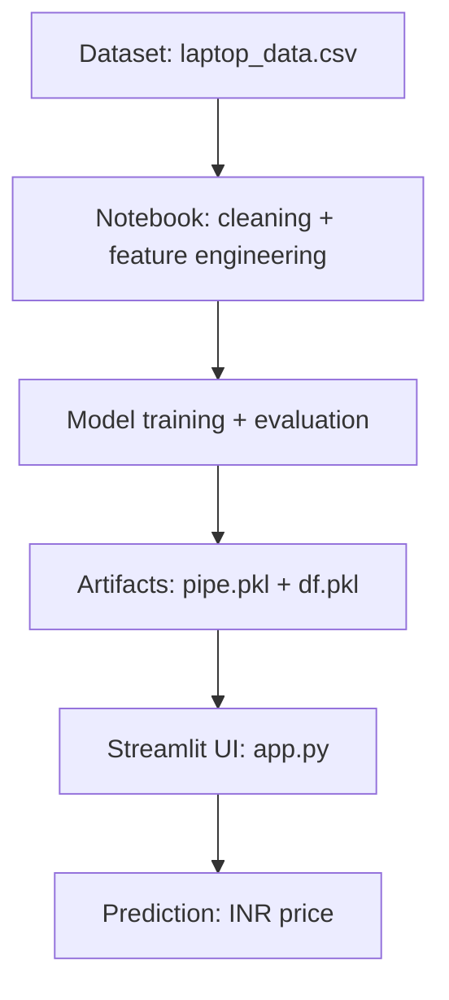

# Laptop Price Predictor

Streamlit app that predicts laptop prices based on hardware and display features. The trained pipeline and reference dataframe are stored in `pipe.pkl` and `df.pkl`.

## Overview

- Train and evaluate a regression model in the notebook.
- Persist the fitted pipeline and reference data.
- Serve predictions through a Streamlit UI.

## Features

- Brand, type, RAM, weight, display, storage, CPU, GPU, and OS inputs
- Automatic PPI calculation from resolution and screen size
- INR price output formatted with commas

## Project Structure

```
.
├── app.py
├── df.pkl
├── laptop_data.csv
├── laptop_data.ipynb
├── pipe.pkl
└── requirement.txt
```

## Workflow Diagram



## Pipeline Flow

1. Load dataset from `laptop_data.csv` in the notebook.
2. Clean and normalize fields (RAM, weight, OS, storage, display specs).
3. Engineer features such as PPI from resolution and screen size.
4. Train and validate the regression model.
5. Persist artifacts as `pipe.pkl` (pipeline) and `df.pkl` (reference data).
6. Streamlit app loads artifacts and collects user inputs.
7. App builds a feature vector and returns the predicted INR price.

## Requirements

Install the dependencies listed in `requirement.txt`:

- pandas
- numpy
- scikit-learn
- matplotlib
- seaborn
- streamlit

## Setup

1. Create and activate a virtual environment (optional but recommended).
2. Install dependencies:

```bash
pip install -r requirement.txt
```

## Run the App

```bash
streamlit run app.py
```

Open the local URL shown in the terminal to use the app.

## Notes

- The app expects `pipe.pkl` and `df.pkl` in the project root.
- Input price is predicted in INR and formatted with commas.
